# Proyecto imageproject - prueba técnica imágenes en formato A4

Aplicativo encargado de recibir imágenes en formato JPG de cualquier dimensión (Ancho x alto) para ajustarlas a una hoja de hoja tamaño A4 (796 x 1123 pixeles) sin márgenes. Se cumple con las siguientes reglas:
* La orientación de la página es definida a partir de la orientación de la imagen (Horizontal/Vertical).
* La imagen no pierde perder su ratio (Relación de aspecto ancho por alto).
* Ninguna imagen es agrandada en el proceso, solo encogida cuando corresponda.
* Se aprovecha el máximo de la hoja A4.

## Aspectos no funcionales

### Rendimiento y optimización de recursos
La aplicación almacena en disco la imagen cargada y poseé una base de datos relacional donde se almacena nombre, ruta, dimensiones escaladas y orientación; dando así persistencia a los archivos cargados por el usuario. Las imágenes que se guardan ya poseen el escalado aplicado y así se evita el reprocesamiento al momento de cargar la imagen desde la galería. Respecto a la orientación de la página tambien se toma desde la base de datos para asignar directamente una clase css al div que incluye la imagen.

### Seguridad

A nivel de seguridad se restringe el uso de la aplicación solo para usuarios registrados, donde unicamente tendrán acceso a su colección de imágenes personal. Para esto se desarrolla un sistema de autenticación y se restringe el acceso a las vistas mediante decoradores y redireccionamiento automático al formulario de inicio de sesión cuando se intenta acceder directamente por URL. Por ejemplo, al intentar acceder a la URL http://ec2-100-24-35-32.compute-1.amazonaws.com:8000/upload para ingresar al formulario de carga de imágenes, el usuario que no ha iniciado sesión sera redireccionado a la URL http://ec2-100-24-35-32.compute-1.amazonaws.com:8000/accounts/login/?next=/upload

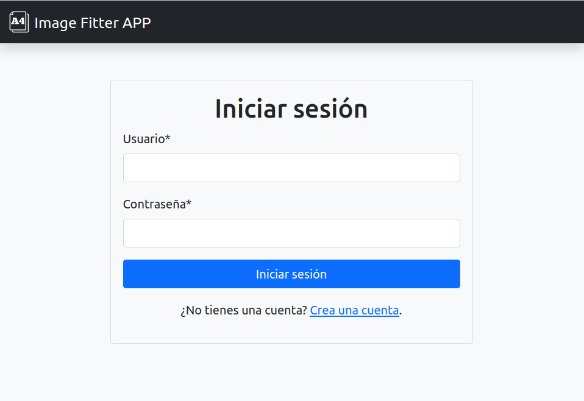

Se agrega el formulario de registro para otorgar acceso a la aplicación de usuarios nuevos.

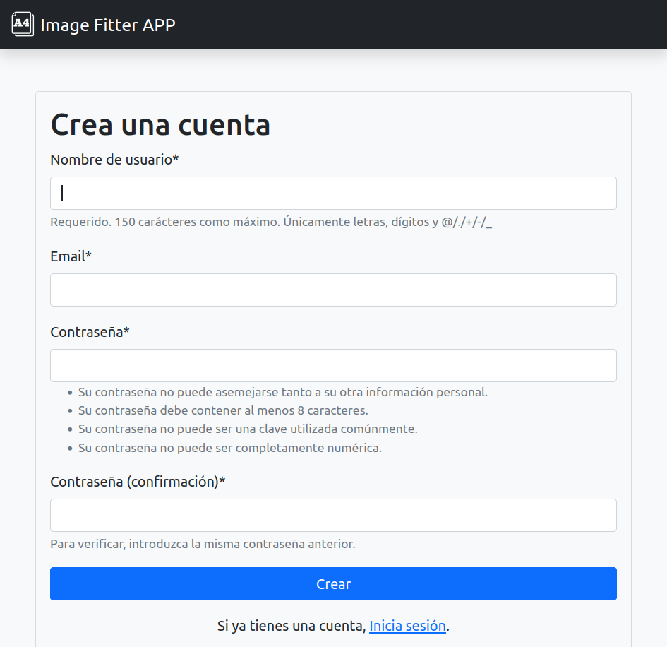

Respecto al formulario de carga de imágenes se aplican las siguientes validaciones para evitar el ingreso de archivos no permitidos:

* validación de tipo de archivo: solo se permiten imágenes por lo que cualquier archivo de tipo diferente que intente ser cargado lanzará mensaje de error.

* validación de formato: solo se permiten imágenes formato jpg o jpeg, por lo que cualquier archivo de diferente formato cargado lanzará mensaje de error. Cabe resaltar que el formato del archivo es diferente a la extensión del mismo, para está aplicación se hizo la prueba de cambiar la extension de un archivo de .png a .jpg obteniendo un resultado exitoso al rechazar este archivo corrupto.

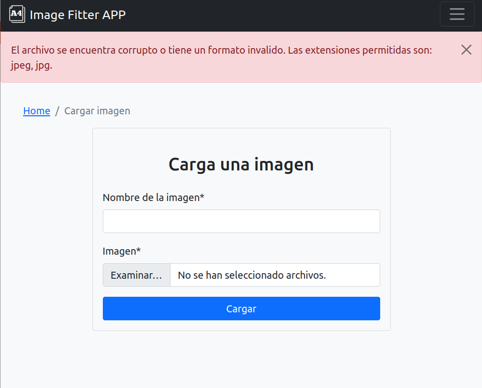

### Cobertura de pruebas unitarias

Las pruebas unitarias se implementan usando el módulo **unittest** de Django. Para correr los test se instala la librería **coverage** de python que adicionalmente permite generar reportes y exportar el archivo coverage.xml, que sirve como insumo para calcular el indice de cobertura de pruebas en la herramienta SonarQube; ya que este último solo puede ejecutar test mediante integraciones con otras herramientas.

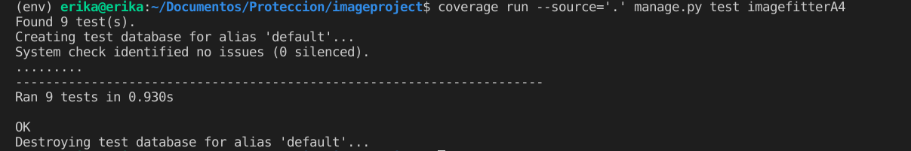

Según el reporte de cobertura de pruebas generado por la libreria **coverage**, se tiene una cobertura del 80% sobre el código.
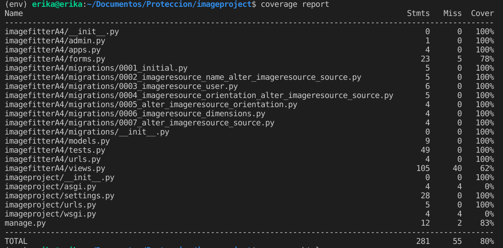

El porcentaje de cobertura de pruebas presentado por **SonarQube** fue del 79.6%, cuya diferencia puede deberse al redondeo de los decimales, ya que este valor es tomado del reporte contenido en el archivo coverage.xml generado por la librería **coverage**.

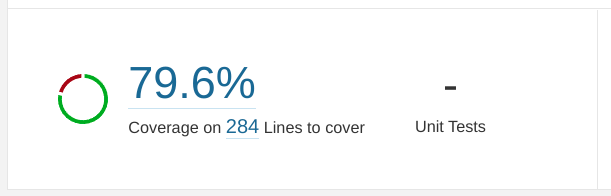

### Índice de deuda técnica

[SonarQube](https://www.sonarqube.org/) es una plataforma de software libre para evaluar la calidad del código fuente, realizando un análisis estático sobre dicho código, con el objetivo de informar sobre diferentes puntos a mejorar.

Esta plataforma define un ratio de deuda tecnica usando la metodología SQALE (Software Quality Assessment based on Lifecycle Expectations) que se basa en bloques duplicados de código, las pruebas unitarias falladas, ramas cubiertas por las pruebas unitarias insuficientes, densidad de comentarios insuficientes, cobertura de líneas cubierta por pruebas unitarias insuficientes y pruebas unitarias omitidas.

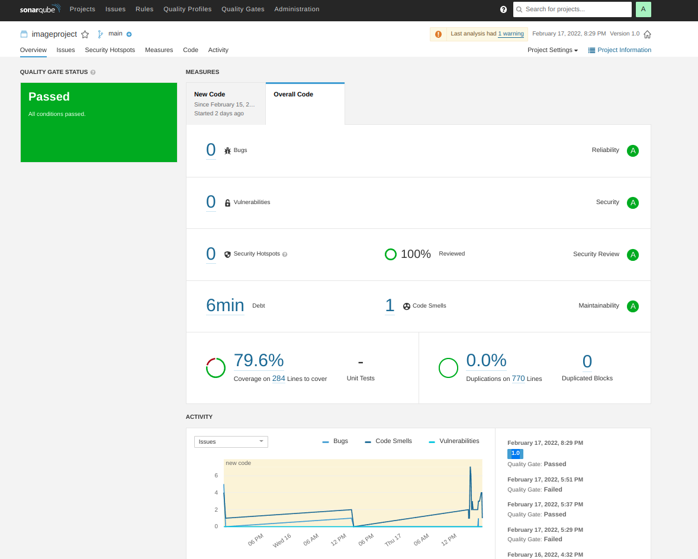

Se obtiene una calificación del SQALE Rating en A, significando que el ratio de deuda técnica es menor al 10%, por lo que se puede considerar que el proyecto se encuentra saludable.  

Revisando el "code smell" reportado por la herramienta, se puede ver que es necesaria una refactorización de la función **upload** ya que posee un grado de complejidad superior al definido en los parametros de evaluación recomendados; el grado de complejidad aumenta conforme aparezcan estructuras condicionales y cíclicas dentro del método por lo que una posible solución sería reevaluar si es estrictamente necesario el uso de estas estructuras o crear nuevas funciones con complejidad inferior para ser llamadas desde upload.

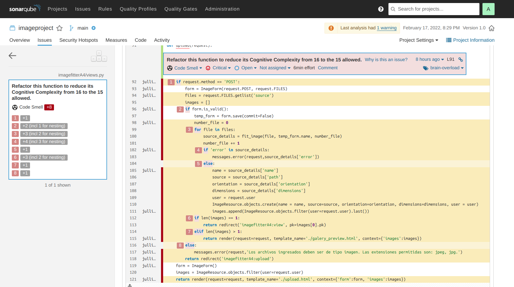

### Código limpio + clean architecture

### Stack usado

* [PostgreSQL](https://www.python.org/) - Es un gestor de base de datos de código libre con gran escalabilidad y robusto, tiene la capacidad de establecer un entorno de alta disponibilidad ya que permite que los clientes hagan consultas de solo lectura mientras el servidor esta en modo de recuperación. Tiene una gran cantidad de extensiones disponibles y se integra con múltiples lenguajes de programación.

* [Python](https://www.python.org/) - Está desarrollado bajo una licencia de código abierto. Es uno de los lenguajes de programación más versátiles que existen, puede ser usado en muchos campos diferentes. Cuenta con una amplia comunidad. Su característica multiplataforma permite que este pueda ser usado en diferentes sistemas operativos.

* [Pip](https://pypi.org/project/pip/) - Es un gestor de paquetes de python, una de sus principales ventajas es el número de librerías disponibles, la facilidad de instalación y la documentación. Permite gestionar listas de paquetes y sus números de versión correspondientes a través de un archivo de requisitos. 

* [Django](https://www.djangoproject.com/) - Es un framework web de alto nivel que permite el desarrollo rápido de sitios web seguros y mantenibles. Es gratuito y de código abierto, tiene una comunidad amplia y activa. Es modular lo que facilita la escalabilidad. Permite usar todos los paquetes disponibles de python.

* [Pillow](https://pillow.readthedocs.io/en/stable/) - Es una biblioteca gratuita de Python que agrega soporte para abrir, manipular y guardar muchos formatos de archivos de imágenes diferentes. Esta posee el método thumbnail() que permite redimensionar una imagen sin perder su relación de aspecto.

* [Boostrap](https://getbootstrap.com/) - Uno de los frameworks más populares a nivel de front end. Permite crear interfaces web con CSS y Javascript que se adaptan en función del tamaño de la pantalla. Facilita plantillas, fuentes, botones y elementos de navegación.

### Estrategia de despliegue

Como **ambiente de desarrollo**, se tiene una versión de la aplicación desplegada de manera local (on-premise) accediendo desde la url http://localhost:8000 habilitada con el comando python manage.py runserver. Desde este ambiente se suben los cambios a la rama "erika"  del presente repositorio.

Como **ambiente productivo** y alimentado por la rama main del repositorio de github, se tiene una versión de la aplicación desplegada en un servidor de AWS (cloud), aprovechando la capa gratuita ofrecida por la compañia. Esta puede accederse mediante la url http://ec2-100-24-35-32.compute-1.amazonaws.com:8000 habilitada con el comando python manage.py runserver que corre dentro de un screen o proceso en segundo plano.

### Responsive
Gracias al uso de Boostrap se logra un diseño adaptativo usando elementos  como navbar y grid. Adicionalmente para definir el tamaño y la orientación de la hoja de referencia para mostrar la imagen, se hace uso de media queries teniendo como puntos de salto, los definidos por Boostrap para los diferentes dispositivos.

* Adaptación usando navbar:

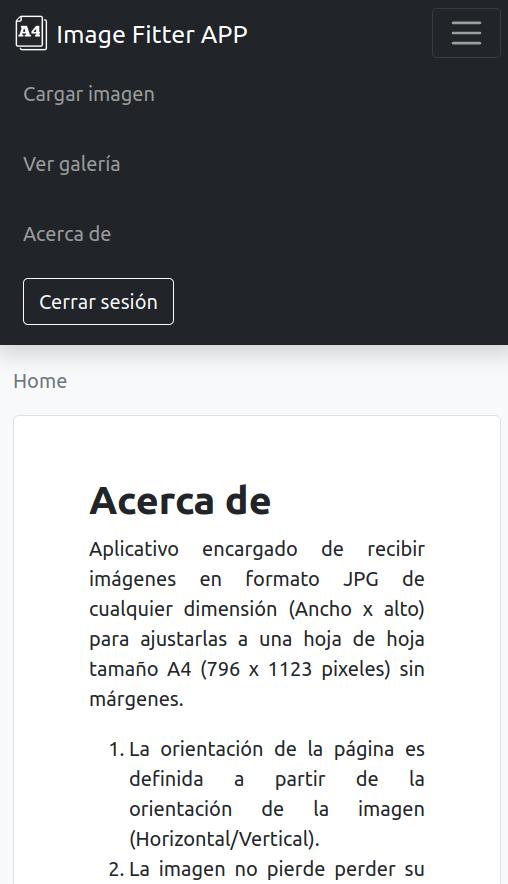

* Adaptación usando los media queries:

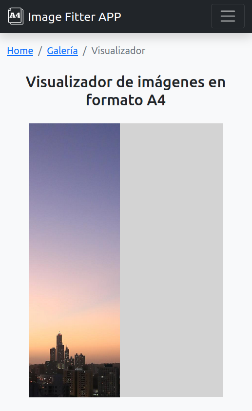

* Adaptación usando grid (clases .col):

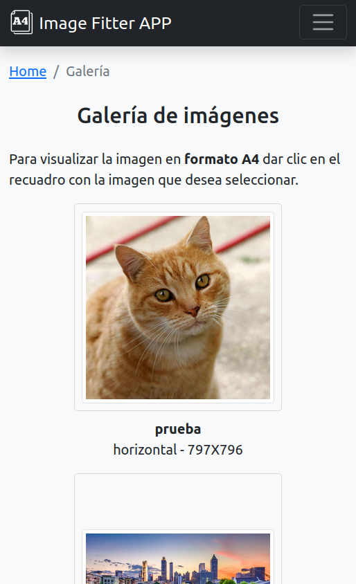
## Aspectos funcionales 
